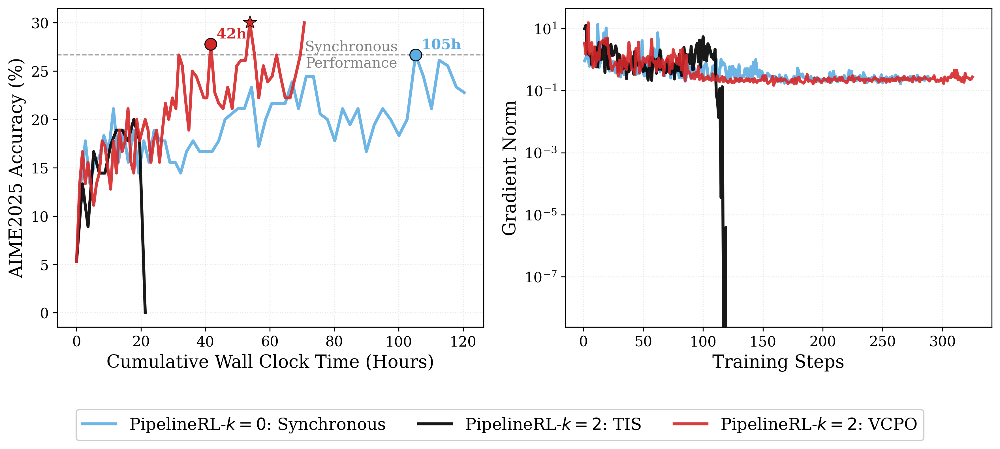
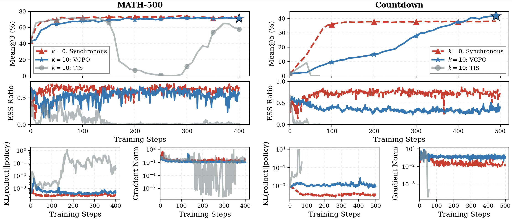
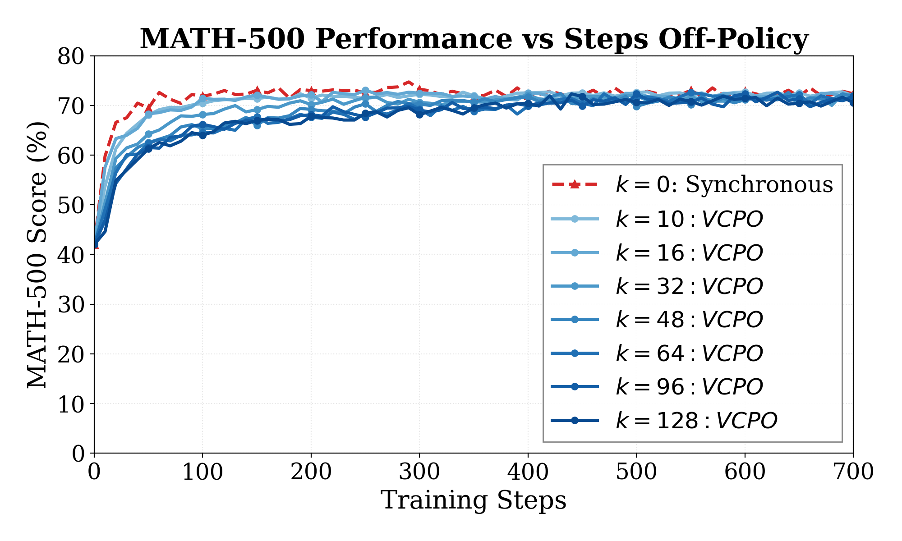

<div align="center">

# VCPO: Variance Controlled Policy Optimization for Stable Asynchronous RL

[](https://arxiv.org/abs/2602.17616)
[](https://github.com/mit-han-lab/vcpo)

</div>

<p align="center">
  
</p>

<div align="center">
  <p>
    <a href="#overview">Overview</a> •
    <a href="#results">Results</a> •
    <a href="#getting-started">Getting Started</a> •
    <a href="#citation">Citation</a> 
  </p>
</div>

## Overview

We introduce Variance Controlled Off-Policy Optimization (VCPO), a framework that adds explicit variance-targeted controls for off-policy RL, enabling stable and scalable Async RL training.

- ✨ Seamlessly integrates into common policy-gradient methods like REINFORCE/RLOO/GRPO
- 🚀 2.5x faster Async RL training while matching synchronous RL performance
- 🧠 Robust training stability under high off-policy settings (at least 128 steps off-policy)

Async RL pipelines rollout generation with learning promises to achieve significant reductions in end-to-end training time. But achieving these speedups requires highly off-policy training, which often leads to collapse

Why? Highly stale rollouts make importance sampling ratios heavy-tailed, so a few trajectories dominate each update and the policy-gradient estimator becomes high-variance. Previous work try masking/clipping/whitening IS ratios, algorithmic changes, and system-side changes. These can delay collapse… but still fail at high asynchrony.

To address, VCPO introduces two techniques to stabilize policy-gradient methods for asynchronous RL training:

1. **ESS-guided step scaling** to dampen unreliable updates, following sqrt scaling for AdamW-style optimizers.

$$
\eta_{\text{eff}} \propto \sqrt{\rho_{\text{ess}}}, \qquad
\rho_{\text{ess}} \triangleq \frac{\mathrm{ESS}}{B} \triangleq
\frac{1}{B}\frac{\left(\sum_{i=1}^{B} w_i\right)^2}{\sum_{i=1}^{B} w_i^2}
$$


2. **Closed-form off-policy optimal baseline (OPOB)** using gradient norm and importance ratios (no learned critic):

$$
b_{\text{OPOB}}^\star=\frac{\sum_{i=1}^N w_i^2 \|\nabla_\theta \log \pi_\theta(\tau_i)\|^2 R_i}{\sum_{i=1}^N w_i^2 \|\nabla_\theta \log \pi_\theta(\tau_i)\|^2}
$$

## Results

Across math/general reasoning/tool use tasks and model sizes from 1.5B to 7B, VCPO enables stable training where prior methods fail. In long-context multi-turn RL, this delivers a **2.5x** end-to-end speedup while matching synchronous performance.

<p align="center">
  
</p>

End-to-end training times and validation accuracy for synchronous vs. asynchronous training (lag `k`).

#### Countdown

<div align="center">

| Method | Countdown ↑ | Steps | GPU hours ↓ |
| --- | ---: | ---: | ---: |
| Base | 1.6% | -- | -- |
| Sync (`k=0`) | 38.4% | 400 | 143.2 |
| VCPO + Async (`k=10`) | **41.9%** | 400 | **89.6** |

</div>

#### MATH-500

<div align="center">

| Method | MATH-500 ↑ | Steps | GPU hours ↓ |
| --- | ---: | ---: | ---: |
| Base | 40.2% | -- | -- |
| Sync (`k=0`) | 72.0% | 400 | 134.4 |
| VCPO + Async (`k=10`) | 71.6% | 400 | **92.8** |

</div>

#### AIME 2025

<div align="center">

| Method | AIME 2025 ↑ | Steps | GPU hours ↓ |
| --- | ---: | ---: | ---: |
| Base | 5.3% | -- | -- |
| Sync (`k=0`) | 26.7% | 300 | 420.2 |
| VCPO + Async (`k=2`) | **27.8%** | 220 | **168.9** |

</div>


Async RL already achieves its full speedups at <10-steps off-policy, but we stress-tested far beyond that and found VCPO remains stable up to at least **128 steps off-policy**.

<p align="center">
  
</p>


## Getting Started

VCPO is implemented for the Megatron backend, with core logic in [megatron_actor.py](verl/workers/actor/megatron_actor.py), [vcpo.py](verl/workers/utils/vcpo.py), and [staleness_utils.py](recipe/fully_async_policy/staleness_utils.py). Training scripts are under [recipe/fully_async_policy/shell/vcpo/](recipe/fully_async_policy/shell/vcpo/).

**1. Install** — follow the [veRL documentation](https://verl.readthedocs.io/en/latest/start/install.html) to set up the environment. Specifically, we use Megatron-Core 0.13.1 with vLLM 0.11.0 following the conda installation instructions.

**2. Prepare data**

```
hf download lukhuang/vcpo --repo-type dataset --local-dir data
```

**3. Train**

Edit the model and data paths in the script, then launch

### GSM8K and MATH-500 Experiments

GSM8K experiments use the Qwen2-1.5B model and use the official train-test split.

```bash
# Synchronous (k=0)
bash recipe/fully_async_policy/shell/vcpo/gsm8k/synchronous.sh

# Fully asynchronous VCPO (k=12)
bash recipe/fully_async_policy/shell/vcpo/gsm8k/vcpo_k=12.sh
```

MATH experiments use the Qwen2.5-7B model and use the official train-test split.

```bash
# Synchronous
bash recipe/fully_async_policy/shell/vcpo/math/synchronous.sh

# Fully asynchronous training + VCPO
bash recipe/fully_async_policy/shell/vcpo/math/vcpo_k=10.sh

# Highly off-policy asynchronous training + VCPO
bash recipe/fully_async_policy/shell/vcpo/math/vcpo_k=16.sh  # k=16 steps off-policy
bash recipe/fully_async_policy/shell/vcpo/math/vcpo_k=32.sh  # k=32 steps off-policy
bash recipe/fully_async_policy/shell/vcpo/math/vcpo_k=64.sh  # k=64 steps off-policy
bash recipe/fully_async_policy/shell/vcpo/math/vcpo_k=128.sh # k=128 steps off-policy
```

### Long-Horizon Tool-Use Experiments

We evaluate long-horizon tool use in the SimpleTIR setting, where the model must interleave reasoning with external tool calls. We train using the DAPO dataset and evaluate on a held-out exam-style benchmark (AIME2025).

```bash
# Synchronous
bash recipe/fully_async_policy/shell/vcpo/multiturn/synchronous.sh

# Fully asynchronous VCPO
bash recipe/fully_async_policy/shell/vcpo/multiturn/vcpo_k=2.sh
```

## Citation

If you find this work useful, please consider citing:

```bibtex
@article{huang2026stable,
  title = {Stable Asynchrony: Variance-Controlled Off-Policy RL for LLMs},
  author = {Luke J. Huang and Zhuoyang Zhang and Qinghao Hu and Shang Yang and Song Han},
  year = {2026},
  month = {Feb},
  url = {https://arxiv.org/abs/2602.17616}
}
```

## License and Attribution

This repository was implemented on top of [veRL](https://github.com/volcengine/verl) at commit 15a9b0f58a8be2445417493ae7911439c9700cf2.

It is licensed under the Apache License, Version 2.0. See [LICENSE](/LICENSE) for details.